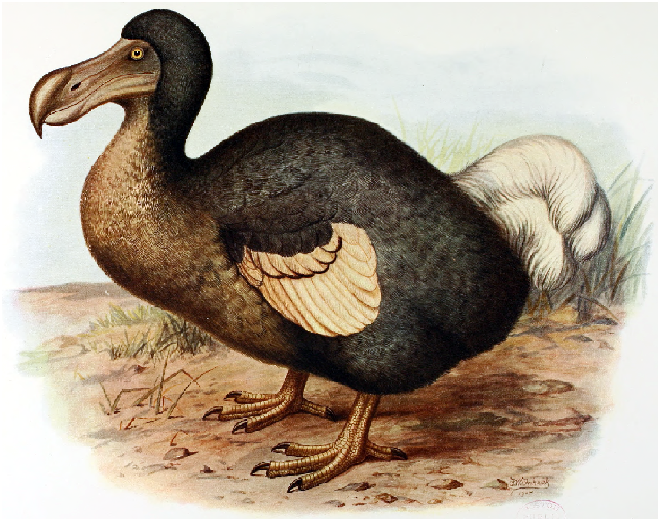

# dodolang


> Program <==> Data

🛸Do What U Want To Do.

# Overview
📑Game Engine Internal Script.

# Index
- [dodolang](#dodolang)
- [Overview](#overview)
- [Index](#index)
- [Install](#install)
- [Build](#build)
- [Usage](#usage)
- [Awesome](#awesome)
- [Changelog](#changelog)
- [Todo](#todo)
- [LICENSE](#license)

# Install
download form [releases](#) or build form source.

***build requirement***
- [goyacc](https://godoc.org/golang.org/x/tools/cmd/goyacc)

# Build
```
# go get dodolang
go get github.com/zhzluke96/dodolang/dolang
go get github.com/zhzluke96/dodolang/dodolang

cd $(go env GOPATH)/src/github.com/zhzluke96/dodolang/dodolang/
./build.sh

# build tools...
```

# Usage
```go
func print(text){
    __do__ {
        'text' load print
    }
    return
}

func add(a,b){
    return a+b 
}

func main(){
    a = 10
    b = -8.5
    res = add(a,b)
    print(res)
}

main()
```

# Awesome
```go
var Y,F
Y = func(f){
    (func(x) {
        x(x)
    })(func(x){
        f(func(y){
            x(x)(y)
        })
    })
}


F = func(g){
    func(n){
        if n == 0 {
            return 1
        } else {
            return n * g(n-1)
        }
    }
}

FACT = Y(F)
FACT(5) // =>  120
```

# Changelog
- 理了一下

# Todo
- debugger
- array of scratch
- parameter-changeable
- new parser for new dolang
- bytescode
- compile .wasm file
- 简化grammer，理想的样子是js的语义+python的运行时类型推导+rust的卫生宏

# LICENSE
GPL-3.0